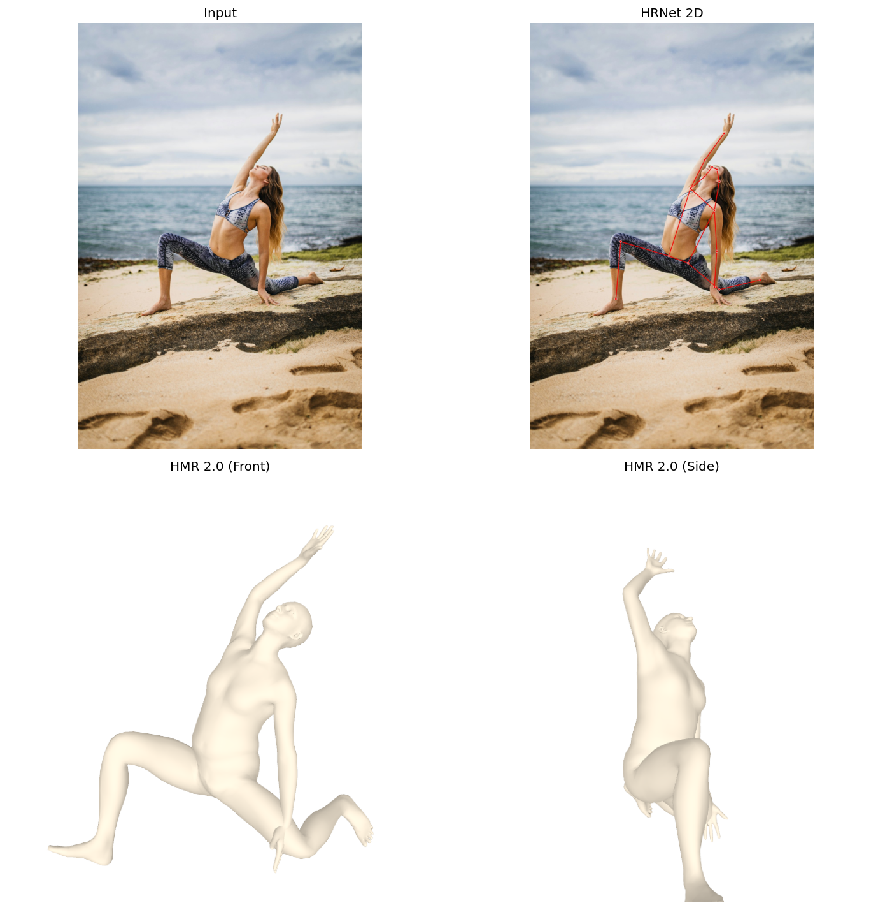
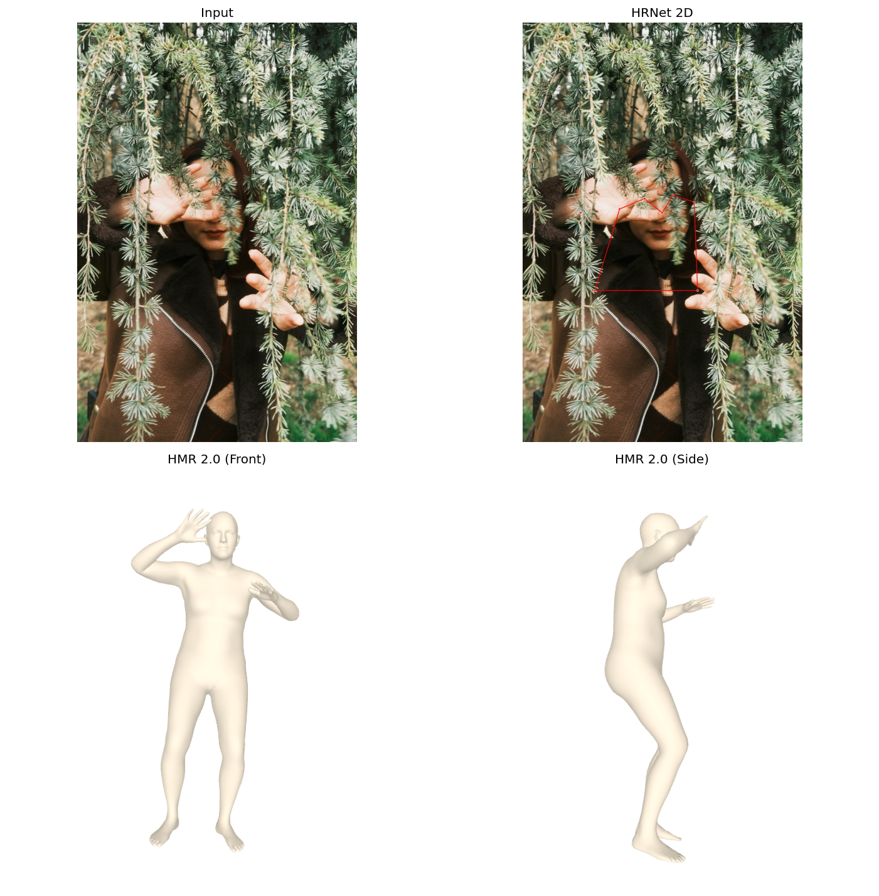
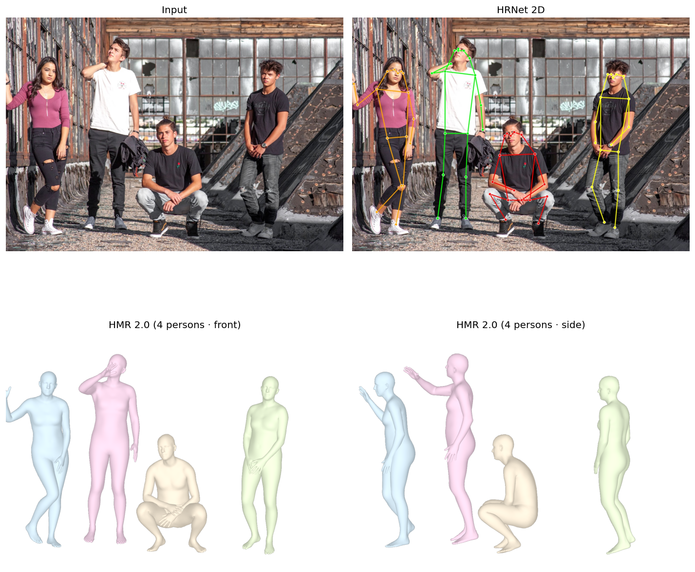

# From 2D Keypoints to 4D Humans

**Research question:** *How did the field progress from estimating 2D keypoints in pixel space to recovering full 3D parametric body shape — and now 4D human tracks — from a single RGB image or video?*

Final project for *Intro to Computer Vision* (Spring 2026). The demo pipes an
RGB image through **ViTDet → HRNet-W48 → HMR 2.0 (4D-Humans)** to recover a
SMPL 3D mesh; for video, **PHALP** runs HMR 2.0 per frame and stitches
identities across time into 4D tracks.

| Paper | Role in our story |
|---|---|
| **OpenPose** — Cao et al., TPAMI 2019 | Bottom-up multi-person 2D via Part Affinity Fields |
| **HRNet** — Sun et al., CVPR 2019 | High-resolution 2D backbone (our 2D stage) |
| **HMR** — Kanazawa et al., CVPR 2018 | Single-image 3D SMPL recovery with adversarial body prior |
| HMR 2.0 / 4D-Humans (Goel 2023) | ViT-based descendant — the actual checkpoint we run |
| PHALP (Rajasegaran 2022) | Video extension: HMR 2.0 + tracking → 4D |

## Showcase

Quad-plots produced by `demo/scripts/run_pipeline.py` on four CC0 photos
(input | HRNet 2D | HMR mesh front | HMR mesh side):

| Standing | Complex pose |
|---|---|
|  |  |
| **Occluded** | **Multi-person (4 people)** |
|  |  |

PHALP on an 8.6 s tennis clip — per-track HMR 2.0 mesh re-projected onto
the source frame:


Extras (mini-SMPLify reimplementation, 3D → 2D reprojection consistency,
pose-feature distance matrix, tennis joint angles) live under
[`demo/showcase/extras/`](demo/showcase/extras).

## Repository layout

| Path | What lives there |
|---|---|
| [`demo/`](demo/README.md) | Working model — image and video pipelines + showcase outputs |
| [`third_party/`](third_party/) | Trimmed copies of [4D-Humans](https://github.com/shubham-goel/4D-Humans) (HMR 2.0) and [PHALP](https://github.com/brjathu/PHALP), vendored with our patches |
| [`LiteratureReview/`](LiteratureReview/) | 2-page LaTeX report (`main.tex`, `refs.bib`, `main.pdf`) |
| [`papers/`](papers/) | The five referenced papers (PDFs) |
| [`presentation/`](presentation/) | 12-slide deck + speaker notes |
| [`tests/`](tests/) | Unit tests |

## Quick start

```bash
git clone git@github.com:ethanliu001111-lang/CVFinal.git && cd CVFinal
python3.12 -m venv .venv && source .venv/bin/activate
pip install -e third_party/4D-Humans -e third_party/PHALP

# Register at smpl.is.tue.mpg.de, download body models, then:
export CV_MODEL_ROOT=/abs/path/to/registered/models
bash demo/scripts/setup_smpl_paths.sh

# Image path
python demo/scripts/run_pipeline.py demo/test_images/*.jpg --device cuda

# (optional) Video path + extras
python -m phalp.track \
    video.source=demo/test_videos/tennis.mp4 \
    video.output_dir=demo/results/tennis_phalp \
    video.end_frame=1300
bash demo/scripts/make_extras.sh
```

Outputs land under [`demo/showcase/`](demo/showcase/). Full instructions in
[`demo/README.md`](demo/README.md).

## Authors

- **Yiqiao Liu** — OpenPose §3.1 + HMR §3.3 + Future Directions §5; slides + live talk on those papers
- **Taijia Liang** — Intro/Background §1–§2 + HRNet §3.2 + Comparison §4; demo extension; slides for connecting narrative + demo

## License & third-party models

This repository is MIT-licensed (see [`LICENSE`](LICENSE)). The SMPL, SMPL-X,
VPoser, 4D-Humans, and PHALP weights are **not** distributed here; each user
must register and download them independently. Full third-party license matrix
in [`demo/checkpoints/DOWNLOAD.md`](demo/checkpoints/DOWNLOAD.md).
