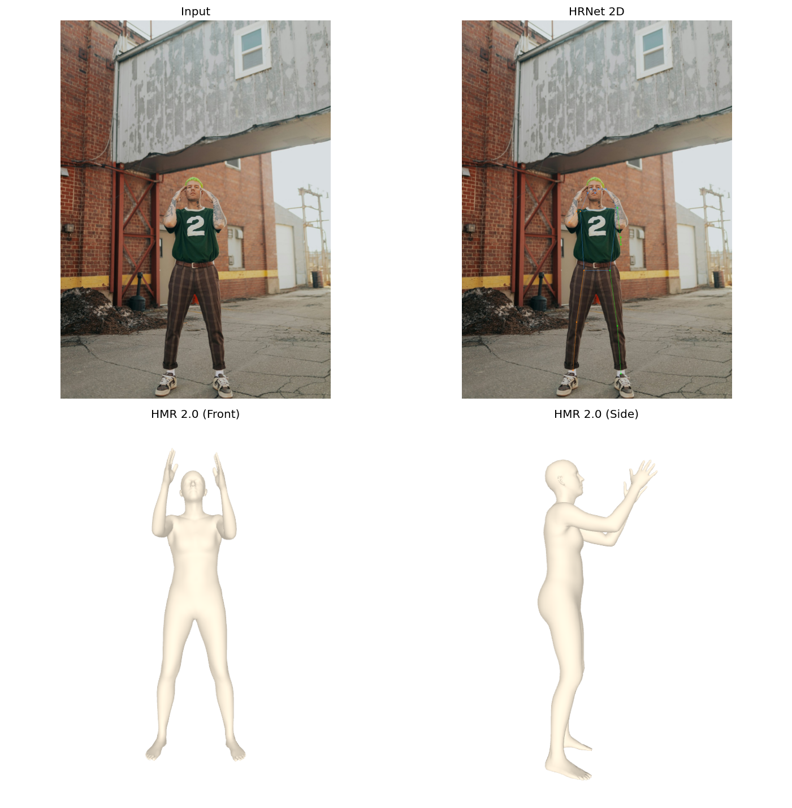
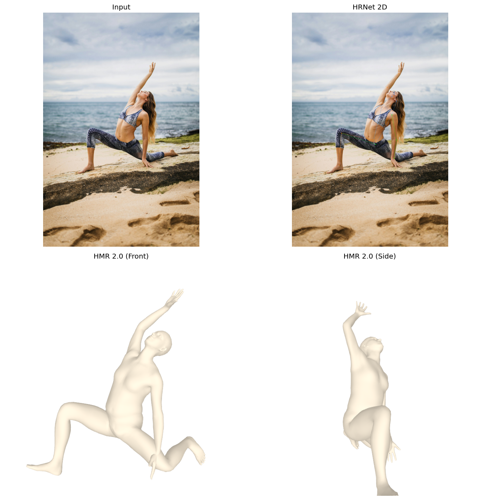
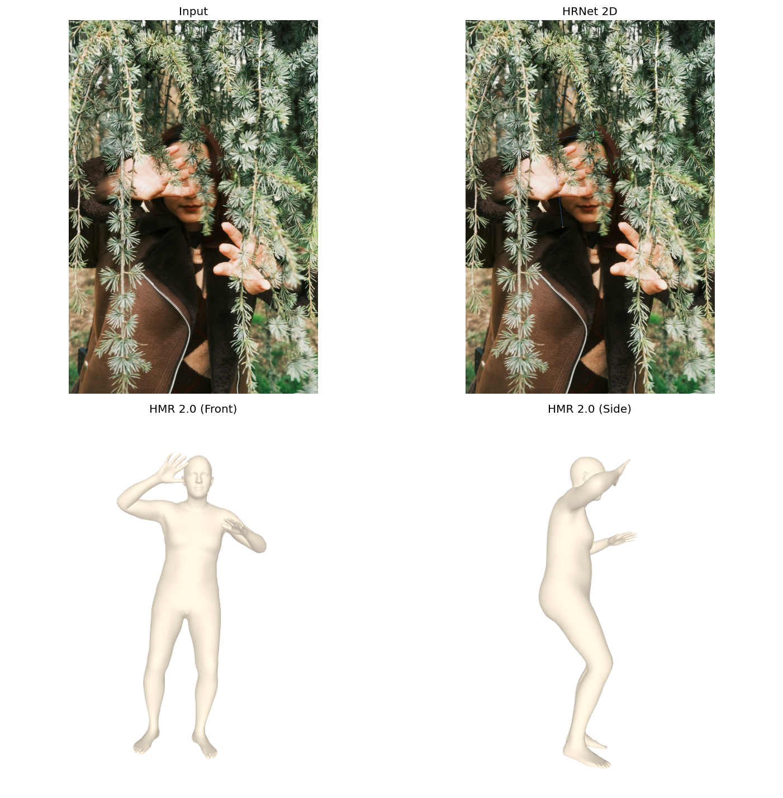
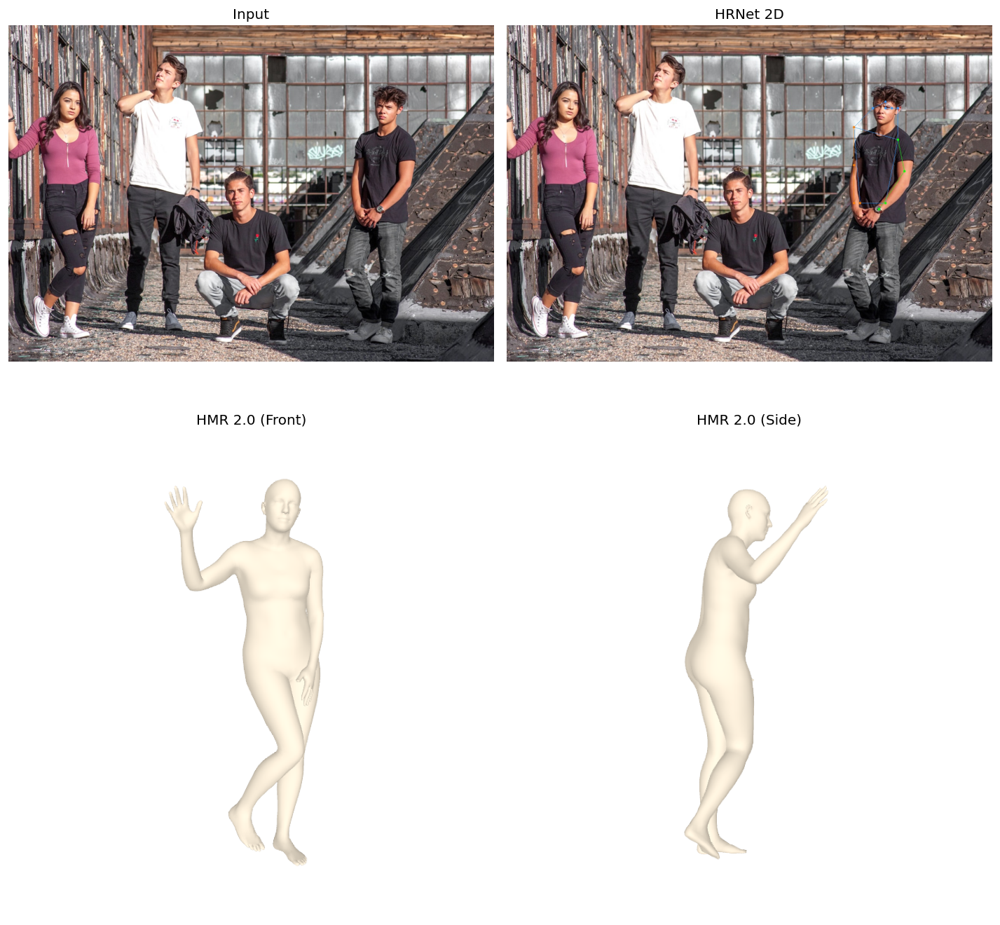
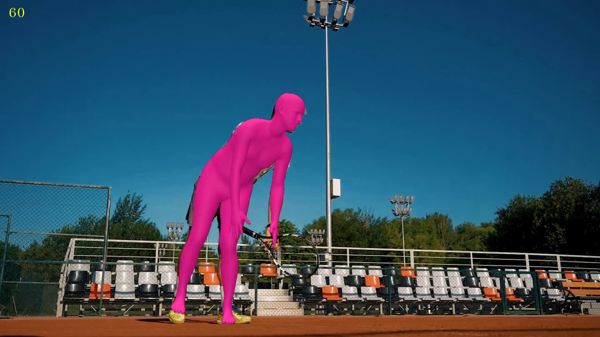

# From 2D Keypoints to 4D Humans

**Research question:** *How did the field progress from estimating 2D keypoints in pixel space to recovering full 3D parametric body shape — and now 4D human tracks — from a single RGB image or video?*

Final project for *Intro to Computer Vision* (Spring 2026). Given an RGB
image (or video), the demo pipes it through HRNet-W48 to get 2D keypoints,
then through HMR 2.0 (4D-Humans) to lift them to a SMPL 3D mesh; for video,
PHALP runs HMR 2.0 per frame and stitches identities across time into 4D
tracks.

| Paper | Role in our story |
|---|---|
| **OpenPose** — Cao et al., TPAMI 2019 | Bottom-up multi-person 2D via Part Affinity Fields |
| **HRNet** — Sun et al., CVPR 2019 | High-resolution 2D backbone (used as our 2D stage) |
| **HMR** — Kanazawa et al., CVPR 2018 | Single-image 3D SMPL recovery with adversarial body prior |
| HMR 2.0 / 4D-Humans (Goel 2023) | ViT-based descendant — the actual checkpoint we run |
| PHALP (Rajasegaran 2022) | Video extension: HMR 2.0 + tracking → 4D |

## Showcase

Quad-plots produced by `demo/scripts/run_pipeline.py` on four CC0 photos
(input + 2D keypoints + front-view mesh + 90° side view):

| Standing | Complex pose |
|---|---|
|  |  |
| **Occluded** | **Multi-person** |
|  |  |

PHALP on an 8.6 s tennis clip — per-track HMR 2.0 mesh re-projected onto
the source frame:



## Repository layout

| Path | What lives there |
|---|---|
| [`demo/`](demo/README.md) | Working model — image and video pipelines |
| [`third_party/`](third_party/) | Trimmed copies of [4D-Humans](https://github.com/shubham-goel/4D-Humans) (HMR 2.0) and [PHALP](https://github.com/brjathu/PHALP), vendored with our patches for reproducibility |
| [`LiteratureReview/`](LiteratureReview/) | 2-page LaTeX report (`main.tex`, `refs.bib`, `main.pdf`) |
| [`papers/`](papers/) | The three core papers (PDFs) |
| [`presentation/`](presentation/) | Slide-by-slide presentation script |
| [`tests/`](tests/) | Unit tests |

## Quick start

```bash
git clone git@github.com:ethanliu001111-lang/CVFinal.git && cd CVFinal
python3.12 -m venv .venv && source .venv/bin/activate

# Install vendored 4D-Humans + PHALP editable
pip install -e third_party/4D-Humans -e third_party/PHALP

# Wire up SMPL model files (after registering at smpl.is.tue.mpg.de)
export CV_MODEL_ROOT=/path/to/registered/models
bash demo/scripts/setup_smpl_paths.sh

python demo/scripts/run_pipeline.py demo/test_images/*.jpg --device cuda
```

Full instructions in [`demo/README.md`](demo/README.md).

## Course information

- **Submission**: Sunday, May 10, 2026 — 11:59 PM EDT
- **Presentation**: Monday, May 11, 2026 — 5:00–9:00 PM, **60FA 110**
- **Deliverables**: 8-min slides + 2-page LaTeX report + working model

## Authors

- **Yiqiao Liu** — OpenPose §3.1 + HMR §3.3 + Future Directions §5; slides + live talk on those papers
- **Taijia Liang** — Intro/Background §1–§2 + HRNet §3.2 + Comparison §4; demo extension; slides for connecting narrative + demo

## License & third-party models

This repository is MIT-licensed (see [`LICENSE`](LICENSE)). The SMPL,
SMPL-X, VPoser, 4D-Humans, and PHALP weights are **not** distributed
here; each user must register and download them independently. Full
third-party license matrix in
[`demo/checkpoints/DOWNLOAD.md`](demo/checkpoints/DOWNLOAD.md).
